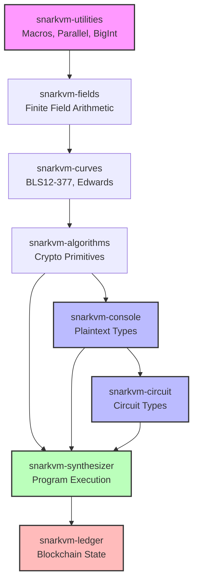

SnarkVM is organized as a Rust workspace with multiple interdependent crates. This modular architecture enables clear separation of concerns, efficient compilation, and maintainable code.

## Crate Dependency Graph

SnarkVM follows a strict bottom-up dependency hierarchy with no circular dependencies:



## Core Crates

### snarkvm-utilities

**Purpose**: Foundation crate providing low-level utilities and macros.

**Location**: `utilities/`

**Dependencies**: None (bottom of dependency tree)

**Key Exports**:
```rust
pub mod biginteger;      // BigInteger256, BigInteger384
pub mod bititerator;     // Bit manipulation utilities
pub mod bits;            // Bit vector operations
pub mod bytes;           // Byte serialization helpers
pub mod parallel;        // Rayon parallel primitives
pub mod serialize;       // CanonicalSerialize/Deserialize
```

**Usage**: Every other crate depends on utilities for:
- Serialization traits
- Parallel iteration (`cfg_iter!`, `cfg_chunks!`)
- Big integer arithmetic
- Error handling

### snarkvm-fields

**Purpose**: Finite field arithmetic for cryptographic operations.

**Location**: `fields/`

**Dependencies**: `snarkvm-utilities`

**Key Types**:
```rust
pub struct Fp256<P: Fp256Parameters>;  // 256-bit prime field
pub struct Fp384<P: Fp384Parameters>;  // 384-bit prime field
pub struct Fp2<P: Fp2Parameters>;      // Quadratic extension field
pub struct Fp12<P>;                    // 12th degree extension field

pub trait Field: Clone + PartialEq + Eq {
    fn zero() -> Self;
    fn one() -> Self;
    fn inverse(&self) -> Option<Self>;
    fn square(&self) -> Self;
    // ... arithmetic operations
}
```

**Special Functions**:
- `batch_inversion()`: Montgomery's trick for efficient batch inversion
- Parallel field operations when `serial` feature is disabled

### snarkvm-curves

**Purpose**: Elliptic curve implementations (BLS12-377, Edwards BLS12).

**Location**: `curves/`

**Dependencies**: `snarkvm-fields`, `snarkvm-utilities`

**Key Curves**:
```rust
// BLS12-377: Pairing-friendly curve for SNARKs
pub mod bls12_377 {
    pub type Fq = Fp384<FqParameters>;        // Base field
    pub type Fr = Fp256<FrParameters>;        // Scalar field
    pub struct G1Affine;                       // G1 group
    pub struct G2Affine;                       // G2 group
    pub struct Bls12_377;                      // Pairing
}

// Edwards BLS12: Edwards curve for signatures
pub mod edwards_bls12 {
    pub struct EdwardsAffine<P: EdwardsParameters>;
    pub struct EdwardsProjective<P: EdwardsParameters>;
}
```

### snarkvm-algorithms

**Purpose**: Cryptographic algorithms and primitives.

**Location**: `algorithms/`

**Dependencies**: `snarkvm-curves`, `snarkvm-fields`, `snarkvm-utilities`

**Module Structure**:
```rust
pub mod crypto_hash;     // Poseidon hash function
pub mod fft;             // Fast Fourier Transform for polynomials
pub mod msm;             // Multi-scalar multiplication
pub mod polycommit;      // Polynomial commitment schemes
pub mod r1cs;            // R1CS constraint system
pub mod snark;           // Varuna SNARK implementation
pub mod srs;             // Structured reference string
```

**R1CS Constraint System** (`algorithms/src/r1cs/`):
```rust
pub trait ConstraintSystem<F: Field> {
    fn new_variable<Fn>(&mut self, mode: Mode, f: Fn) -> Result<Variable>;
    fn enforce_constraint(&mut self, lc1: LinearCombination<F>,
                          lc2: LinearCombination<F>,
                          lc3: LinearCombination<F>) -> Result<()>;
}

pub enum Index {
    Public(usize),   // Public witness variable
    Private(usize),  // Private witness variable
}
```

**Varuna SNARK** (`algorithms/src/snark/varuna/`):
- Algebraic Holographic Proof (AHP) for R1CS
- Polynomial commitment based proving system
- Efficient verification with batch techniques

### snarkvm-console

**Purpose**: Plaintext types for native program execution.

**Location**: `console/`

**Dependencies**: `snarkvm-algorithms`, `snarkvm-curves`, `snarkvm-fields`, `snarkvm-utilities`

**Module Structure**:
```rust
pub mod account;      // PrivateKey, ViewKey, Address, Signature
pub mod algorithms;   // Poseidon, BHP, Pedersen, Varuna wrappers
pub mod collections;  // Indexed data structures
pub mod network;      // Network trait and parameters
pub mod program;      // Program, Function, Instruction types
pub mod types;        // Primitive types (Field, Group, etc.)
```

**Type Exports** (`console/types/src/lib.rs`):
```rust
pub use snarkvm_console_types_address::Address;
pub use snarkvm_console_types_boolean::Boolean;
pub use snarkvm_console_types_field::Field;
pub use snarkvm_console_types_group::Group;
pub use snarkvm_console_types_integers::{I8, I16, I32, I64, I128,
                                          U8, U16, U32, U64, U128};
pub use snarkvm_console_types_scalar::Scalar;
pub use snarkvm_console_types_string::StringType;
```

**Console Field Type** (`console/types/field/src/lib.rs:39`):
```rust
pub struct Field<E: Environment> {
    field: E::Field,  // Wraps native field element
}
```

### snarkvm-circuit

**Purpose**: Circuit types that generate R1CS constraints.

**Location**: `circuit/`

**Dependencies**: `snarkvm-console`, `snarkvm-algorithms`

**Module Structure**:
```rust
pub mod account;      // Circuit account types
pub mod algorithms;   // Circuit crypto primitives
pub mod collections;  // Circuit data structures
pub mod environment;  // Circuit environment and traits
pub mod network;      // Circuit network types
pub mod program;      // Circuit program types
pub mod types;        // Circuit primitive types
```

**Circuit Field Type** (`circuit/types/field/src/lib.rs:50`):
```rust
pub struct Field<E: Environment> {
    linear_combination: LinearCombination<E::BaseField>,
    bits_le: OnceCell<Vec<Boolean<E>>>,  // Cached bit representation
}

impl<E: Environment> Inject for Field<E> {
    type Primitive = console::Field<E::Network>;
    fn new(mode: Mode, field: Self::Primitive) -> Self;
}

impl<E: Environment> Eject for Field<E> {
    type Primitive = console::Field<E::Network>;
    fn eject_value(&self) -> Self::Primitive;
}
```

**Circuit Environment** (`circuit/environment/src/lib.rs`):
```rust
pub trait Environment: Clone {
    type Network: console::Network;
    type BaseField: PrimeField;
    
    fn new_variable(mode: Mode, value: Self::BaseField) -> Variable<Self::BaseField>;
    fn enforce_constraint(lc1: LinearCombination<Self::BaseField>,
                         lc2: LinearCombination<Self::BaseField>,
                         lc3: LinearCombination<Self::BaseField>);
}

pub enum Mode {
    Constant,  // No constraints, value is constant
    Public,    // Public input variable
    Private,   // Private witness variable
}
```

<Note>
  The `Mode` enum determines whether a circuit variable generates constraints. `Constant` values are optimized away and don't appear in the constraint system.
</Note>

### snarkvm-synthesizer

**Purpose**: Program compilation, execution, and proof generation.

**Location**: `synthesizer/`

**Dependencies**: `snarkvm-circuit`, `snarkvm-console`, `snarkvm-algorithms`

**Submodules**:
```rust
pub mod process;   // Process, Stack, Trace
pub mod program;   // Program, Function, Instruction parsing
pub mod snark;     // Proving/Verifying key management
pub mod vm;        // Virtual machine interface
```

**Process and Stack** (`synthesizer/process/src/stack/mod.rs:211`):
```rust
pub struct Stack<N: Network> {
    program: Program<N>,
    stacks: Weak<RwLock<IndexMap<ProgramID<N>, Arc<Stack<N>>>>>,
    register_types: Arc<RwLock<IndexMap<Identifier<N>, RegisterTypes<N>>>>,
    finalize_types: Arc<RwLock<IndexMap<Identifier<N>, FinalizeTypes<N>>>>,
    universal_srs: UniversalSRS<N>,
    proving_keys: Arc<RwLock<IndexMap<Identifier<N>, ProvingKey<N>>>>,
    verifying_keys: Arc<RwLock<IndexMap<Identifier<N>, VerifyingKey<N>>>>,
    // ...
}
```

**Call Stack** (`synthesizer/process/src/stack/mod.rs:103`):
```rust
pub enum CallStack<N: Network> {
    Authorize(Vec<Request<N>>, Option<PrivateKey<N>>, Authorization<N>),
    Synthesize(Vec<Request<N>>, PrivateKey<N>, Authorization<N>),
    CheckDeployment(/* ... */),
    Evaluate(Authorization<N>),
    Execute(Authorization<N>, Arc<RwLock<Trace<N>>>),
    PackageRun(/* ... */),
}
```

### snarkvm-ledger

**Purpose**: Blockchain state management (blocks, transactions, storage).

**Location**: `ledger/`

**Dependencies**: `snarkvm-synthesizer`

**Submodules**:
```rust
pub mod authority;    // Authority signature and verification
pub mod block;        // Block structure and transitions
pub mod committee;    // Validator committee management
pub mod narwhal;      // Narwhal BFT consensus components
pub mod puzzle;       // Proof-of-work puzzle for coinbase
pub mod query;        // Ledger query interface
pub mod store;        // Database storage layer
```

## Synchronization Requirements

<Warning>
  Console and circuit crates must stay perfectly synchronized. When modifying one, always check the other.
</Warning>

The architecture enforces synchronization through:

1. **Identical Module Structure**: Both `console/types/` and `circuit/types/` have matching subdirectories
2. **Parallel Implementations**: Each console type has a circuit equivalent
3. **Shared Test Suite**: Circuit types test against console types for equivalence
4. **Constraint Count Tests**: Verify circuit operations generate expected constraint counts

## Workspace Configuration

The root `Cargo.toml` defines 91 workspace members:

```toml
[workspace]
members = [
  "algorithms",
  "circuit",
  "circuit/types",
  "circuit/types/field",
  "circuit/types/group",
  # ... 86 more crates
  "console",
  "console/types",
  "console/types/field",
  "console/types/group",
  # ... console types
  "synthesizer",
  "ledger",
  # ...
]
```

This allows:
- Shared dependency versions across all crates
- Consistent compilation profiles
- Efficient incremental builds

## Build Profiles

From `Cargo.toml:627`:

```toml
[profile.release]
opt-level = 3
lto = "thin"
incremental = true

[profile.dev]
opt-level = 3        # Optimize even in dev for acceptable performance
lto = "off"
incremental = true
```

<Info>
  SnarkVM uses `opt-level = 3` even in dev mode because cryptographic operations are too slow without optimization.
</Info>

## Feature Flags

Key features for customization:

- `serial`: Disable parallel execution (for debugging)
- `cuda`: Enable GPU acceleration for proof generation
- `rocks`: Use RocksDB for ledger storage
- `async`: Enable async runtime for networking
- `wasm`: Compile to WebAssembly
- `test`: Enable testing utilities

## Next Steps

<CardGroup cols={2}>
  <Card title="Console & Circuit" icon="code-branch" href="./consensus-and-circuit">
    Learn how the dual type system maintains consensus
  </Card>
  <Card title="Zero-Knowledge Proofs" icon="shield-halved" href="./zero-knowledge-proofs">
    Understand SNARK implementation details
  </Card>
</CardGroup>
