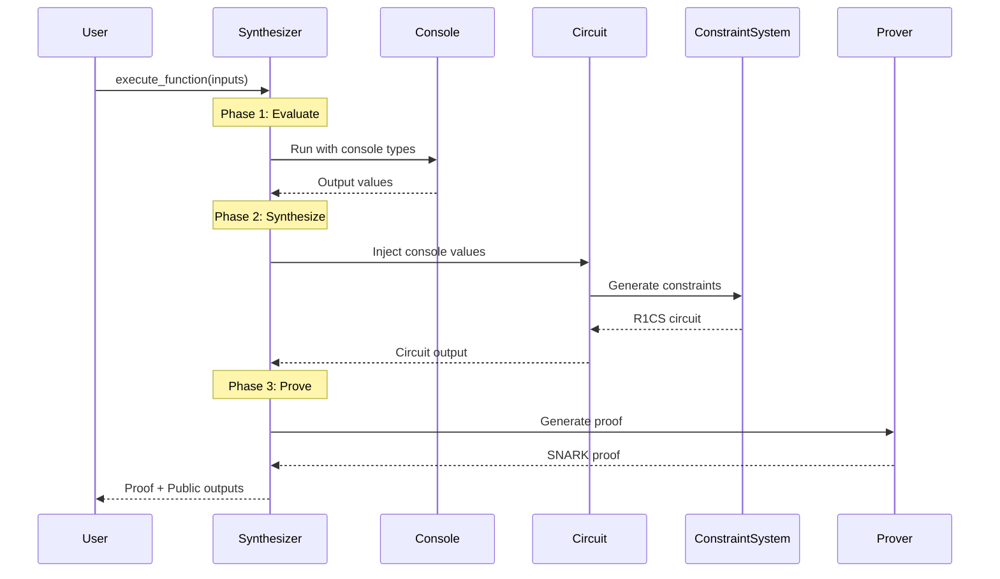

SnarkVM's most distinctive architectural feature is its dual type system: every operation exists in both **console** (plaintext) and **circuit** (constraint-generating) forms. This design enables the same program to run in native mode for fast evaluation and in circuit mode for proof generation.

## The Two Worlds

### Console Types: Native Execution

Console types in `snarkvm-console-types` execute natively on the CPU using standard Rust field arithmetic:

```rust
// console/types/field/src/lib.rs:38
pub struct Field<E: Environment> {
    field: E::Field,  // Native field element (Fp256, Fp384, etc.)
}

impl<E: Environment> Field<E> {
    pub fn new(field: E::Field) -> Self {
        Self { field }
    }
}
```

**Characteristics**:
- Fast native arithmetic (nanoseconds per operation)
- Direct field element manipulation
- No constraint generation overhead
- Used for transaction verification and plaintext evaluation

**Usage**:
```rust
use snarkvm_console_types::Field;
use snarkvm_console_network_environment::prelude::*;

type ConsoleField = Field<Testnet>;

let a = ConsoleField::one();
let b = ConsoleField::from_u128(42);
let c = a + b;  // Direct field addition, no constraints
```

### Circuit Types: Constraint Generation

Circuit types in `snarkvm-circuit-types` generate R1CS constraints for proof generation:

```rust
// circuit/types/field/src/lib.rs:49
pub struct Field<E: Environment> {
    linear_combination: LinearCombination<E::BaseField>,
    bits_le: OnceCell<Vec<Boolean<E>>>,  // Cached bit decomposition
}

impl<E: Environment> Inject for Field<E> {
    type Primitive = console::Field<E::Network>;
    
    fn new(mode: Mode, field: Self::Primitive) -> Self {
        Self {
            linear_combination: E::new_variable(mode, *field).into(),
            bits_le: Default::default(),
        }
    }
}
```

**Characteristics**:
- Each operation generates R1CS constraints
- Variables tracked in constraint system
- Three modes: `Constant`, `Public`, `Private`
- Used for proof generation during program execution

**Usage**:
```rust
use snarkvm_circuit::prelude::*;

type CircuitField = Field<Circuit>;

let a = CircuitField::new(Mode::Private, console::Field::one());
let b = CircuitField::new(Mode::Public, console::Field::from(42u128));
let c = &a + &b;  // Generates constraints: c = a + b
```

## Synchronization Requirement

<Warning>
  Console and circuit types must produce **identical results** for identical inputs. Any divergence will cause consensus failures.
</Warning>

From `AGENTS.md:25`:

> **console / circuit sync requirement:**
> - These crate families must stay in sync. Same structure, same API.
> - When modifying one, check the other.
> - Test circuit equivalence by comparing constraint counts.

### Why Synchronization Matters

Consider a transaction that transfers tokens:

1. **Local Execution**: User runs console types to verify the transaction works
2. **Proof Generation**: Synthesizer runs circuit types to generate a SNARK proof
3. **Network Verification**: Validators run console types to verify the proof

If console and circuit diverge:
- User sees valid transaction locally
- Proof generation succeeds with different values
- Validators reject the transaction
- **Result**: Consensus fork and network partition

## Type Correspondence

Every console type has an exact circuit equivalent:

| Console Type | Circuit Type | Purpose |
|--------------|--------------|----------|
| `console::Field<E>` | `circuit::Field<E>` | Base field elements |
| `console::Group<E>` | `circuit::Group<E>` | Elliptic curve points |
| `console::Scalar<E>` | `circuit::Scalar<E>` | Scalar field elements |
| `console::Boolean<E>` | `circuit::Boolean<E>` | Boolean values |
| `console::Address<E>` | `circuit::Address<E>` | Account addresses |
| `console::U8<E>` | `circuit::U8<E>` | 8-bit unsigned integers |
| `console::I32<E>` | `circuit::I32<E>` | 32-bit signed integers |
| `console::StringType<E>` | `circuit::StringType<E>` | UTF-8 strings |

### Module Mirroring

Both crate families have identical structure:

```
console/types/
├── address/
├── boolean/
├── field/
├── group/
├── integers/
├── scalar/
└── string/

circuit/types/
├── address/
├── boolean/
├── field/
├── group/
├── integers/
├── scalar/
└── string/
```

## Inject and Eject Traits

Circuit types implement two key traits for converting between console and circuit representations:

### Inject: Console → Circuit

```rust
pub trait Inject {
    type Primitive;  // The console type
    
    fn new(mode: Mode, value: Self::Primitive) -> Self;
}
```

**Modes**:
- `Mode::Constant`: Value is compile-time constant, no variable allocated
- `Mode::Public`: Value is public input, allocated as public variable
- `Mode::Private`: Value is private witness, allocated as private variable

**Example** (from `circuit/types/field/src/lib.rs:67`):
```rust
impl<E: Environment> Inject for Field<E> {
    type Primitive = console::Field<E::Network>;

    fn new(mode: Mode, field: Self::Primitive) -> Self {
        Self {
            linear_combination: E::new_variable(mode, *field).into(),
            bits_le: Default::default(),
        }
    }
}
```

### Eject: Circuit → Console

```rust
pub trait Eject {
    type Primitive;  // The console type
    
    fn eject_value(&self) -> Self::Primitive;
    fn eject_mode(&self) -> Mode;
}
```

**Example** (from `circuit/types/field/src/lib.rs:76`):
```rust
impl<E: Environment> Eject for Field<E> {
    type Primitive = console::Field<E::Network>;

    fn eject_value(&self) -> Self::Primitive {
        console::Field::new(self.linear_combination.value())
    }
    
    fn eject_mode(&self) -> Mode {
        self.linear_combination.mode()
    }
}
```

## Constraint Generation

### Linear Combinations

Circuit types internally represent values as linear combinations of variables:

```rust
pub struct LinearCombination<F: Field> {
    constant: F,
    terms: Vec<(Variable, F)>,  // (variable, coefficient) pairs
}
```

For example, the expression `2*a + 3*b + 5` is represented as:
```rust
LinearCombination {
    constant: 5,
    terms: vec![(var_a, 2), (var_b, 3)],
}
```

### R1CS Constraints

Operations enforce constraints in the form `A * B = C` where A, B, C are linear combinations:

```rust
pub trait ConstraintSystem<F: Field> {
    fn enforce_constraint(
        &mut self,
        a: LinearCombination<F>,
        b: LinearCombination<F>,
        c: LinearCombination<F>,
    ) -> Result<()>;
}
```

**Example**: Field multiplication `c = a * b` generates:
```rust
enforce_constraint(
    a.into(),           // A = a
    b.into(),           // B = b  
    c.into(),           // C = c
);  // Constraint: a * b = c
```

## Operation Examples

### Addition

**Console** (from `console/types/field/src/arithmetic.rs`):
```rust
impl<E: Environment> Add<Field<E>> for Field<E> {
    type Output = Field<E>;

    fn add(self, other: Field<E>) -> Self::Output {
        Field::new(self.field + other.field)  // Native field addition
    }
}
```

**Circuit** (from `circuit/types/field/src/add.rs`):
```rust
impl<E: Environment> Add<Field<E>> for Field<E> {
    type Output = Field<E>;

    fn add(self, other: Field<E>) -> Self::Output {
        // Linear combinations can be added without constraints
        Field::from(self.linear_combination + other.linear_combination)
    }
}
```

<Info>
  Field addition is "free" in circuits - it doesn't generate constraints because linear combinations can be combined directly.
</Info>

### Multiplication

**Console** (from `console/types/field/src/arithmetic.rs`):
```rust
impl<E: Environment> Mul<Field<E>> for Field<E> {
    type Output = Field<E>;

    fn mul(self, other: Field<E>) -> Self::Output {
        Field::new(self.field * other.field)  // Native field multiplication
    }
}
```

**Circuit** (from `circuit/types/field/src/mul.rs`):
```rust
impl<E: Environment> Mul<Field<E>> for Field<E> {
    type Output = Field<E>;

    fn mul(self, other: Field<E>) -> Self::Output {
        let output = witness!(|a, b| console::Field::new(a * b));
        // Enforce constraint: self * other = output
        E::enforce_constraint(
            (&self).into(),
            (&other).into(),
            (&output).into(),
        );
        output
    }
}
```

<Note>
  Field multiplication generates **1 R1CS constraint**. This is the fundamental cost unit for circuit complexity.
</Note>

### Comparison

**Console** (from `console/types/field/src/compare.rs`):
```rust
impl<E: Environment> PartialEq for Field<E> {
    fn eq(&self, other: &Self) -> bool {
        self.field == other.field  // Native equality check
    }
}
```

**Circuit** (from `circuit/types/field/src/equal.rs`):
```rust
impl<E: Environment> Equal<Self> for Field<E> {
    type Output = Boolean<E>;

    fn is_equal(&self, other: &Self) -> Self::Output {
        // Compute difference
        let difference = self - other;
        // Check if difference is zero
        difference.is_zero()
    }
}
```

Equality checking in circuits is more complex:
1. Compute `diff = a - b`
2. Check `diff == 0` using inverse computation
3. Generates multiple constraints for zero-check

## Testing Equivalence

Circuit types include tests that verify equivalence with console types:

```rust
#[test]
fn test_add_matches_console() {
    let mut rng = TestRng::default();
    
    for _ in 0..ITERATIONS {
        let a_console = console::Field::rand(&mut rng);
        let b_console = console::Field::rand(&mut rng);
        let expected = a_console + b_console;
        
        let a_circuit = Field::new(Mode::Private, a_console);
        let b_circuit = Field::new(Mode::Public, b_console);
        let candidate = a_circuit + b_circuit;
        
        assert_eq!(expected, candidate.eject_value());
    }
}
```

These tests ensure:
- Circuit operations produce same results as console
- All input combinations are tested
- Edge cases (zero, max, negative) are covered

## Program Execution Flow



## Performance Implications

### Console Execution

- **Speed**: Native CPU instructions, ~nanoseconds per operation
- **Use Cases**: Transaction validation, blockchain state queries, proof verification
- **Memory**: Minimal overhead, direct field elements

### Circuit Execution

- **Speed**: Constraint generation ~microseconds, proving ~milliseconds to seconds
- **Use Cases**: Proof generation for transactions and programs
- **Memory**: Stores entire constraint system (can be gigabytes for large programs)

<Warning>
  Constraint count directly impacts proof generation time. Optimize circuits by minimizing multiplications and comparisons.
</Warning>

## Best Practices

### For SnarkVM Contributors

1. **Always modify both**: When changing console types, update circuit types identically
2. **Test equivalence**: Add tests comparing console and circuit outputs
3. **Document constraints**: Note how many constraints each operation generates
4. **Avoid divergence**: Never add console-only or circuit-only behavior

### For Aleo Program Developers

1. **Understand cost model**: Multiplications are expensive, additions are free
2. **Minimize constraints**: Refactor to reduce circuit operations
3. **Test locally**: Use console mode for rapid iteration
4. **Profile circuits**: Measure constraint counts for performance tuning

## Common Pitfalls

<Warning>
  **Never use `unwrap()` without justification**. From `AGENTS.md:40`: All `unwrap`s must have a comment justifying why they can't panic.
</Warning>

Other issues to avoid:

1. **Floating point**: No floating point types exist; use fixed-point field arithmetic
2. **Overflow**: Integer types wrap by default; use checked operations for safety
3. **Randomness**: Circuit randomness must come from witness, not generated internally
4. **Serialization**: Ensure deterministic serialization for consensus

## Next Steps

<CardGroup cols={2}>
  <Card title="Zero-Knowledge Proofs" icon="shield-halved" href="./zero-knowledge-proofs">
    Learn how circuits become SNARKs
  </Card>
  <Card title="Architecture" icon="sitemap" href="./architecture">
    Explore the full crate structure
  </Card>
</CardGroup>
