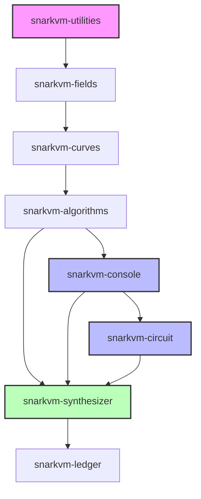
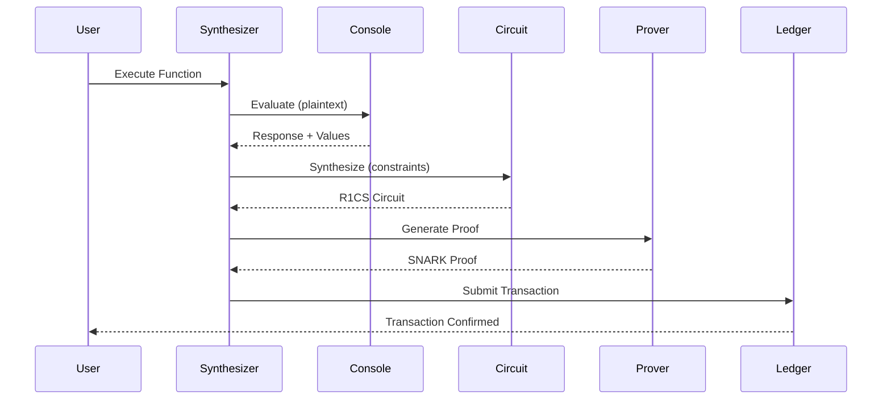

SnarkVM is a virtual machine for zero-knowledge proof execution on the Aleo blockchain. It provides a complete framework for writing, compiling, and executing privacy-preserving programs with cryptographic guarantees.

## What is SnarkVM?

SnarkVM is a decentralized virtual machine that combines:

- **Zero-Knowledge Proofs**: Cryptographic proofs that allow computation verification without revealing inputs
- **R1CS Constraint Systems**: Algebraic circuits that encode program logic as polynomial constraints
- **SNARK Proving System**: Varuna, an efficient algebraic holographic proof system
- **Program Synthesizer**: Compilation from high-level Aleo programs to constraint systems
- **Ledger Integration**: Blockchain state management for transactions, blocks, and consensus

## Design Principles

### 1. Two-Layer Type System

SnarkVM maintains two parallel type hierarchies:

- **Console Types** (`snarkvm-console`): Plaintext values that execute natively
- **Circuit Types** (`snarkvm-circuit`): Constraint-generating equivalents for proof generation

<Warning>
  Console and circuit types must remain perfectly synchronized. Any divergence in behavior can lead to consensus failures in the blockchain.
</Warning>

Every console type like `Field<E>`, `Group<E>`, `Address<E>` has a corresponding circuit type with identical structure and API. This synchronization ensures that:

- Program evaluation (console) produces the same result as proof generation (circuit)
- The same code can run in both plaintext and zero-knowledge modes
- Developers write programs once, and the system handles proof generation

### 2. Layered Architecture

SnarkVM follows a strict dependency hierarchy:

This architecture ensures:
- No circular dependencies
- Clear separation of concerns
- Predictable compilation times
- Modular testing and verification

### 3. Backwards Compatibility

<Warning>
  All changes to SnarkVM must be backwards compatible. Breaking changes can fork the network.
</Warning>

SnarkVM powers a live blockchain with deployed programs. The design enforces:

- **Consensus Safety**: Same inputs must always produce same outputs
- **Serialization Stability**: All types serialize deterministically
- **Proof Verification**: Old proofs remain valid after upgrades
- **Circuit Equivalence**: Console and circuit types produce identical results

## Key Concepts

### Programs and Functions

Aleo programs consist of:

- **Functions**: Public or private operations that can generate proofs
- **Closures**: Inline computations that don't generate separate proofs
- **Finalize**: On-chain state transitions that execute after proof verification

### Execution Modes

SnarkVM supports multiple execution modes:

1. **Evaluation**: Execute console types in plaintext (fast, no proofs)
2. **Authorization**: Prepare execution requests with signatures
3. **Execution**: Generate proofs of correct computation
4. **Verification**: Check proofs against public inputs

### Program Flow

## Type System

SnarkVM provides primitive types in both console and circuit forms:

### Console Types

Located in `snarkvm-console-types`:

- `Address<E>`: Account addresses derived from public keys
- `Boolean<E>`: True/false values
- `Field<E>`: Elements of the base field
- `Group<E>`: Points on the elliptic curve
- `Scalar<E>`: Elements of the scalar field
- `I8, I16, I32, I64, I128`: Signed integers
- `U8, U16, U32, U64, U128`: Unsigned integers
- `StringType<E>`: UTF-8 encoded strings

### Circuit Types

Located in `snarkvm-circuit-types` with identical API:

- Each type wraps `LinearCombination<E::BaseField>`
- Operations generate R1CS constraints
- Circuit types implement `Inject` (console → circuit) and `Eject` (circuit → console)
- Modes: `Constant`, `Public`, `Private` control constraint generation

## Environment and Networks

SnarkVM supports multiple networks:

- **Testnet**: Test network with relaxed parameters
- **Canary**: Pre-production network for final validation
- **Mainnet**: Production Aleo blockchain (via network configurations)

Each network specifies:
- Base field and scalar field
- Elliptic curve parameters
- Hash function (Poseidon)
- Block and transaction limits

## Performance Characteristics

### Console Execution

- Fast native field arithmetic
- No constraint generation overhead
- Used for transaction verification and blockchain validation

### Circuit Execution

- Generates R1CS constraints for each operation
- Constraint count determines proof generation time
- Circuit optimization critical for performance

<Info>
  A simple field addition in console is nanoseconds. In circuit mode, it generates 1 R1CS constraint and contributes to proof generation time (milliseconds to seconds).
</Info>

## Security Model

SnarkVM's security relies on:

1. **Cryptographic Primitives**: BLS12-377 curve, Poseidon hash
2. **SNARK Security**: Varuna proof system with polynomial commitments
3. **Consensus Rules**: Deterministic execution and validation
4. **Input Validation**: All inputs checked at trust boundaries

## Next Steps

<CardGroup cols={2}>
  <Card title="Architecture" icon="sitemap" href="./architecture">
    Deep dive into crate structure and dependencies
  </Card>
  <Card title="Console & Circuit" icon="code-branch" href="./consensus-and-circuit">
    Understand the dual type system
  </Card>
  <Card title="Zero-Knowledge Proofs" icon="shield-halved" href="./zero-knowledge-proofs">
    Learn how SNARKs work in SnarkVM
  </Card>
  <Card title="Quick Start" icon="rocket" href="../quickstart">
    Build your first Aleo program
  </Card>
</CardGroup>
