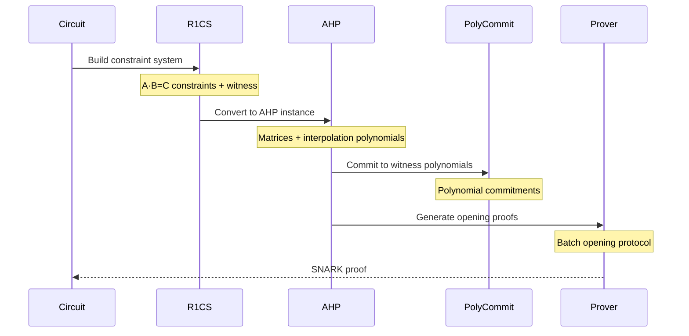

SnarkVM uses zero-knowledge proofs to enable private, verifiable computation on the Aleo blockchain. This page explains how SnarkVM implements SNARKs, from circuit constraints to proof generation and verification.

## What are Zero-Knowledge Proofs?

A zero-knowledge proof allows a prover to convince a verifier that a statement is true without revealing any information beyond the truth of the statement itself.

### Properties of SNARKs

SnarkVM uses **SNARKs** (Succinct Non-interactive Arguments of Knowledge):

- **Succinct**: Proofs are small (~few KB) regardless of computation size
- **Non-interactive**: No back-and-forth between prover and verifier
- **Arguments of Knowledge**: Prover must actually know the witness
- **Zero-Knowledge**: Proof reveals nothing about private inputs

### Use Cases in Aleo

- **Private Transactions**: Transfer tokens without revealing amounts or addresses
- **Private Programs**: Execute arbitrary logic with hidden inputs
- **Proof-Carrying Data**: Chain proofs to create complex privacy-preserving applications
- **Verifiable Computation**: Prove correct execution without re-running

## R1CS Constraint Systems

### Rank-1 Constraint System

SnarkVM represents circuits as **R1CS** (Rank-1 Constraint System), the standard representation for SNARK circuits.

Each constraint has the form:
```
A * B = C
```

Where A, B, C are **linear combinations** of variables:
```
A = a₀ + a₁·x₁ + a₂·x₂ + ... + aₙ·xₙ
```

### Variables and Witnesses

From `algorithms/src/r1cs/mod.rs:54`:

```rust
pub struct Variable(Index);

pub enum Index {
    Public(usize),   // Public input variable
    Private(usize),  // Private witness variable
}
```

**Variable Types**:
- **Public Variables**: Known to both prover and verifier (public inputs/outputs)
- **Private Variables**: Known only to prover (private witness)
- **Constants**: Fixed values compiled into circuit

### Linear Combinations

From `algorithms/src/r1cs/linear_combination.rs`:

```rust
pub struct LinearCombination<F: Field> {
    constant: F,
    terms: Vec<(Variable, F)>,  // (variable_id, coefficient)
}
```

**Example**: The expression `3 + 2·x₁ + 5·x₂` is:
```rust
LinearCombination {
    constant: 3,
    terms: vec![(Variable(Index::Public(1)), 2),
                (Variable(Index::Private(2)), 5)],
}
```

### Constraint System Trait

From `algorithms/src/r1cs/constraint_system.rs:23`:

```rust
pub trait ConstraintSystem<F: Field> {
    fn new_variable<Fn>(
        &mut self,
        mode: Mode,
        f: Fn,
    ) -> Result<Variable>;
    
    fn enforce_constraint(
        &mut self,
        a: LinearCombination<F>,
        b: LinearCombination<F>,
        c: LinearCombination<F>,
    ) -> Result<()>;
}
```

## Circuit Construction

### From Operations to Constraints

Consider the computation `result = (a + b) * (c + d)`:

**Step 1: Decompose**
```
temp1 = a + b
temp2 = c + d
result = temp1 * temp2
```

**Step 2: Generate Constraints**

Additions are free (linear combinations):
```
temp1 = (1·a + 1·b + 0)  // No constraint needed
temp2 = (1·c + 1·d + 0)  // No constraint needed
```

Multiplication requires a constraint:
```
temp1 * temp2 = result  // 1 R1CS constraint
```

**Total Cost**: 1 constraint (only the multiplication)

### Example: Field Multiplication

From `circuit/types/field/src/mul.rs`:

```rust
impl<E: Environment> Mul<Field<E>> for Field<E> {
    type Output = Field<E>;

    fn mul(self, other: Field<E>) -> Self::Output {
        // Allocate output variable with computed value
        let output = witness!(|a, b| console::Field::new(a * b));
        
        // Enforce: self * other = output
        E::enforce_constraint(
            (&self).into(),   // A = self
            (&other).into(),  // B = other
            (&output).into(), // C = output
        );
        
        output
    }
}
```

This generates the constraint: `self * other = output`

### Cost Model

| Operation | Constraints | Notes |
|-----------|-------------|-------|
| Field addition | 0 | Free (linear combination) |
| Field subtraction | 0 | Free (linear combination) |
| Field negation | 0 | Free (coefficient negation) |
| Field multiplication | 1 | Fundamental cost |
| Field division | 2-3 | Inverse + multiplication |
| Field equality | 1-2 | Zero-check via inverse |
| Boolean AND | 1 | Multiplication constraint |
| Boolean OR | 1 | De Morgan's law |
| Integer comparison | O(bits) | Bit decomposition + comparison |

<Info>
  Proof generation time is roughly linear in constraint count. Minimize multiplications and comparisons to optimize circuit performance.
</Info>

## Varuna SNARK System

SnarkVM uses **Varuna**, a polynomial-based SNARK system implementing the AHP (Algebraic Holographic Proof) framework.

### Architecture

From `algorithms/src/snark/varuna/mod.rs:16`:

```rust
pub mod ahp;         // Algebraic Holographic Proof for R1CS
pub mod varuna;      // Varuna zkSNARK proof system
```

### Components

**1. Structured Reference String (SRS)**

Universal setup generating public parameters:

```rust
pub struct UniversalSRS<N: Network> {
    // Polynomial commitment parameters
    // Universal for all circuits up to a maximum size
}
```

**2. Proving Key**

Circuit-specific key for proof generation:

```rust
pub struct ProvingKey<N: Network> {
    circuit_verifying_key: CircuitVerifyingKey<N>,
    circuit_proving_key: CircuitProvingKey<N>,
    // Circuit-specific polynomial commitments
}
```

**3. Verifying Key**

Circuit-specific key for proof verification:

```rust
pub struct VerifyingKey<N: Network> {
    circuit_commitments: Vec<Commitment<N>>,
    circuit_verifying_key: CircuitVerifyingKey<N>,
}
```

**4. Proof**

Succinct proof of computation:

```rust
pub struct Proof<N: Network> {
    commitments: Vec<Commitment<N>>,
    evaluations: Vec<N::Field>,
    batch_proof: BatchProof<N>,
}
```

### Proof Generation Flow



### Polynomial Commitment Scheme

Varuna uses polynomial commitments to achieve succinctness:

1. **Commit**: Prover commits to witness polynomials (few KB)
2. **Query**: Verifier challenges prover at random points
3. **Open**: Prover provides evaluations and opening proofs
4. **Verify**: Verifier checks commitments match opened values

<Note>
  Polynomial commitments compress large witness data into small commitments, enabling succinct proofs.
</Note>

## Program Execution and Proving

### Stack and Process

From `synthesizer/process/src/stack/mod.rs:211`:

```rust
pub struct Stack<N: Network> {
    program: Program<N>,
    universal_srs: UniversalSRS<N>,
    proving_keys: Arc<RwLock<IndexMap<Identifier<N>, ProvingKey<N>>>>,
    verifying_keys: Arc<RwLock<IndexMap<Identifier<N>, VerifyingKey<N>>>>,
    // ...
}
```

Each program function has its own proving/verifying key pair.

### Execution Modes

From `synthesizer/process/src/stack/mod.rs:103`:

```rust
pub enum CallStack<N: Network> {
    Authorize(/* ... */),      // Sign execution request
    Synthesize(/* ... */),     // Generate circuit (no proof)
    CheckDeployment(/* ... */),// Validate deployment circuit
    Evaluate(/* ... */),       // Execute console types only
    Execute(/* ... */),        // Execute + generate proof
    PackageRun(/* ... */),     // Development mode execution
}
```

**Evaluate Mode**: Fast plaintext execution
```rust
let response = stack.evaluate_function(
    function_name,
    inputs,
)?;
// Returns output values, no proof
```

**Execute Mode**: Generate proof
```rust
let (response, proof) = stack.execute_function(
    proving_key,
    function_name,
    inputs,
    rng,
)?;
// Returns output values + SNARK proof
```

### Proof Generation Steps

1. **Evaluation**: Run console types to compute output
2. **Injection**: Convert console values to circuit variables
3. **Synthesis**: Execute circuit, generating constraints
4. **Witness Assignment**: Populate all variables with values
5. **AHP Proving**: Convert R1CS to algebraic holographic proof
6. **Polynomial Commitment**: Commit to witness polynomials
7. **Proof Assembly**: Package commitments and evaluations

### Proof Verification Steps

1. **Parse Public Inputs**: Extract public variables from proof
2. **Circuit Verification**: Check proof against verifying key
3. **Polynomial Checks**: Verify polynomial commitment openings
4. **Output Validation**: Ensure outputs match public values

## Cryptographic Primitives

### Elliptic Curves

SnarkVM uses **BLS12-377** for pairing-based cryptography:

```rust
// curves/src/bls12_377/mod.rs
pub struct Bls12_377;

pub type Fq = Fp384<FqParameters>;  // Base field (384-bit)
pub type Fr = Fp256<FrParameters>;  // Scalar field (256-bit)

pub struct G1Affine;  // Group 1 (on base curve)
pub struct G2Affine;  // Group 2 (on twist)
```

**Properties**:
- 128-bit security level
- Efficient pairing computation
- Edwards curve (EdDSA) compatible scalar field

### Hash Functions

SnarkVM uses **Poseidon** hash for circuit-friendly hashing:

```rust
// algorithms/src/crypto_hash/poseidon.rs
pub struct Poseidon<F: Field, const RATE: usize> {
    // Algebraic hash function optimized for R1CS
}
```

**Benefits**:
- Designed for SNARK circuits
- Low constraint count (~150 constraints per hash)
- Collision-resistant and one-way

## Performance Characteristics

### Typical Proof Times

| Circuit Size | Constraints | Proof Time | Proof Size |
|--------------|-------------|------------|------------|
| Tiny | 1K | ~10ms | ~1KB |
| Small | 10K | ~50ms | ~2KB |
| Medium | 100K | ~500ms | ~3KB |
| Large | 1M | ~5s | ~4KB |
| Very Large | 10M | ~50s | ~5KB |

<Info>
  Proof size is nearly constant (~logarithmic growth), while proving time is linear in constraint count.
</Info>

### Verification Performance

- **Verification Time**: ~1-10ms (independent of circuit size)
- **Verification Cost**: Dominated by pairing computations
- **Batch Verification**: Amortized cost for verifying multiple proofs

## Optimization Strategies

### Circuit-Level Optimizations

1. **Minimize Multiplications**: Each multiplication = 1 constraint
2. **Reuse Computations**: Cache intermediate results
3. **Algebraic Tricks**: Use field properties (e.g., Fermat's little theorem for inversion)
4. **Boolean Packing**: Pack multiple booleans into field elements

### System-Level Optimizations

1. **Parallel Proving**: Leverage multi-core CPUs
2. **GPU Acceleration**: Use CUDA for MSM and FFT
3. **Caching**: Precompute proving keys for common circuits
4. **Batch Processing**: Generate multiple proofs in parallel

### Example: Optimized Range Proof

**Naive Approach** (O(bits) constraints):
```rust
let bits = value.to_bits_le();  // O(bits) constraints
for bit in bits {
    // Constrain each bit is 0 or 1: bit * (1 - bit) = 0
    bit * (1 - bit).enforce_equal(&zero);  // 1 constraint per bit
}
```

**Optimized Approach** (O(log bits) constraints):
```rust
// Use lookup tables or algebraic range proofs
// Reduces constraint count logarithmically
```

## Security Considerations

### Trusted Setup

Varuna requires a **universal trusted setup**:

- One-time ceremony generating SRS
- Universal parameters for all circuits
- Security relies on at least one honest participant

<Warning>
  If all trusted setup participants are malicious, they could create false proofs. The ceremony must be performed securely with multiple independent parties.
</Warning>

### Soundness

SNARK soundness ensures:
- Invalid proofs are rejected with overwhelming probability
- Prover cannot convince verifier of false statements
- Security based on cryptographic assumptions (e.g., discrete log)

### Zero-Knowledge

Proofs reveal:
- **Public Inputs**: Intentionally disclosed (e.g., transaction outputs)
- **Public Outputs**: Computation results
- **Nothing Else**: Private witnesses remain hidden

## Best Practices

### For Circuit Design

1. **Profile First**: Measure constraint counts before optimizing
2. **Test Soundness**: Verify invalid inputs are rejected
3. **Validate Ranges**: Ensure integers stay within bounds
4. **Check Edge Cases**: Test zero, max, and boundary values

### For Program Development

1. **Minimize Circuit Operations**: Use console types where possible
2. **Batch Transactions**: Amortize proof costs across multiple operations
3. **Cache Proving Keys**: Avoid regenerating keys repeatedly
4. **Monitor Constraint Growth**: Track circuit size as programs evolve

## Debugging Circuits

### Constraint Counting

```rust
use snarkvm_circuit::prelude::*;

let count_before = Circuit::num_constraints();
let result = complex_operation(a, b, c);
let count_after = Circuit::num_constraints();

println!("Constraints generated: {}", count_after - count_before);
```

### Witness Inspection

```rust
let value = circuit_variable.eject_value();  // Extract console value
println!("Circuit value: {}", value);
```

### Constraint Checking

```rust
// In tests:
assert!(Circuit::is_satisfied());
assert_count!(1000, 1050);  // Min, max expected constraints
```

## Further Reading

<CardGroup cols={2}>
  <Card title="Overview" icon="book" href="./overview">
    Return to core concepts overview
  </Card>
  <Card title="Console & Circuit" icon="code-branch" href="./consensus-and-circuit">
    Understand the dual type system
  </Card>
  <Card title="Quick Start" icon="rocket" href="../quickstart">
    Build your first program
  </Card>
  <Card title="API Reference" icon="code" href="../api/overview">
    Explore the API documentation
  </Card>
</CardGroup>
