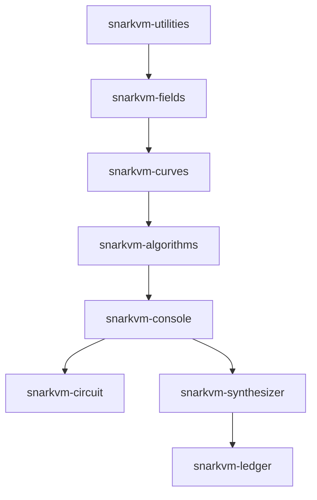

## What is SnarkVM?

SnarkVM is a decentralized virtual machine designed for zero-knowledge proof execution on the Aleo blockchain. It provides a complete toolkit for building privacy-preserving applications with cryptographic guarantees.

<Note>
SnarkVM is the core virtual machine that powers the Aleo network, enabling developers to build applications with native privacy features.
</Note>

## Key Features

<Steps>
  <Step title="Zero-Knowledge Proof Execution">
    Execute programs with cryptographic proof generation, ensuring privacy and correctness without revealing sensitive data.
  </Step>
  
  <Step title="Modular Architecture">
    Built with a clean separation of concerns across multiple crates:
    - **Console**: Plaintext VM types (Address, Field, Group, Scalar)
    - **Circuit**: Constraint system equivalents for proof generation
    - **Synthesizer**: Program execution and proof synthesis
    - **Ledger**: Blockchain state management
  </Step>
  
  <Step title="Cryptographic Primitives">
    Includes battle-tested implementations of:
    - Poseidon hash functions
    - BLS12-377 elliptic curves
    - Varuna SNARK proofs
    - Polynomial commitments
  </Step>
  
  <Step title="Multi-Platform Support">
    Works across platforms with `std` and `wasm` support, enabling both server-side and browser-based applications.
  </Step>
</Steps>

## Architecture Overview

SnarkVM follows a layered architecture where each crate builds upon lower-level components:



### Core Crates

| Crate | Description |
|-------|-------------|
| `snarkvm-algorithms` | Cryptographic primitives (Poseidon, Marlin, Polycommit) |
| `snarkvm-circuit` | Arithmetic circuits for constraint systems |
| `snarkvm-console` | Plaintext VM types and program execution |
| `snarkvm-curves` | Elliptic curve implementations |
| `snarkvm-fields` | Finite field arithmetic |
| `snarkvm-ledger` | Blockchain state (blocks, transactions, storage) |
| `snarkvm-synthesizer` | Program execution and proof generation |
| `snarkvm-utilities` | Parallel primitives and helper functions |

<Warning>
The console and circuit crates must stay synchronized. When modifying console types, ensure circuit equivalents are updated to maintain constraint system correctness.
</Warning>

## Who Should Use SnarkVM?

SnarkVM is ideal for:

- **Blockchain Developers** building privacy-preserving applications on Aleo
- **Cryptography Researchers** working with zero-knowledge proof systems
- **Application Developers** needing verifiable computation with privacy guarantees
- **Protocol Engineers** implementing custom cryptographic protocols

## Design Principles

### Backwards Compatibility

All changes must be backwards compatible to prevent network forks. The codebase is deployed in production, so modifications that alter consensus behavior require version gating.

### Safety and Security

```rust
#![forbid(unsafe_code)]
```

All crates forbid unsafe code unless explicitly approved. Security is paramount in a zero-knowledge proof system.

### Performance

SnarkVM uses parallel execution with `rayon` where appropriate and includes CUDA support for GPU acceleration of cryptographic operations.

## Version Information

<Tabs>
  <Tab title="Current Version">
    **Version**: 4.4.0
    
    **Rust Version**: 1.88.0 or higher
    
    **Edition**: 2024
  </Tab>
  
  <Tab title="License">
    SnarkVM is licensed under the Apache License 2.0.
    
    ```
    Copyright (c) 2019-2026 Provable Inc.
    ```
  </Tab>
</Tabs>

## Next Steps

<CardGroup cols={2}>
  <Card title="Installation" icon="download" href="/installation">
    Install SnarkVM and set up your development environment
  </Card>
  
  <Card title="Quick Start" icon="rocket" href="/quickstart">
    Build your first SnarkVM application
  </Card>
</CardGroup>
